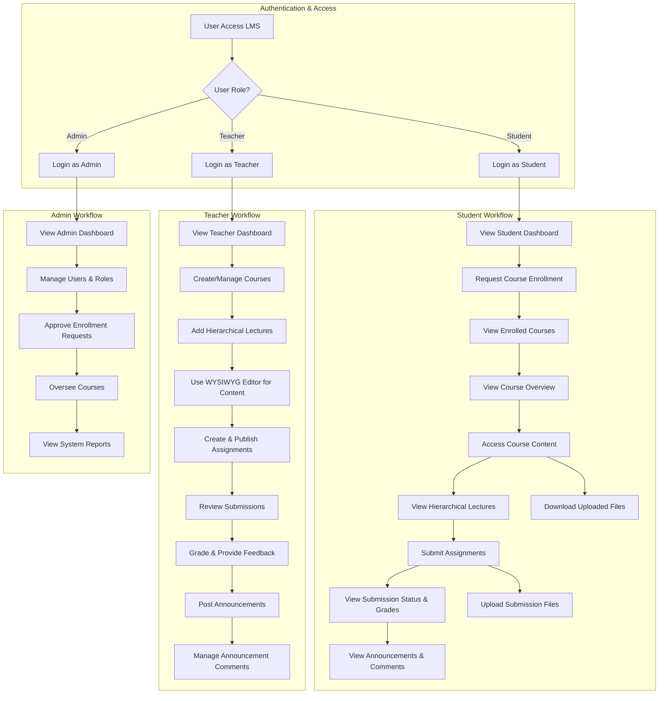

# LMS Project Flowchart

```mermaid
flowchart TD
    A[User Access LMS] --> B{User Role?}
    B -->|Student| C[Login as Student]
    B -->|Teacher| D[Login as Teacher]
    B -->|Admin| E[Login as Admin]

    C --> F[View Student Dashboard]
    F --> G[Request Course Enrollment]
    G --> H[View Enrolled Courses]
    H --> I[View Course Overview]
    I --> J[Access Course Content]
    J --> K[View Hierarchical Lectures]
    K --> L[Submit Assignments]
    L --> M[View Submission Status & Grades]
    M --> N[View Announcements & Comments]

    D --> O[View Teacher Dashboard]
    O --> P[Create/Manage Courses]
    P --> Q[Add Hierarchical Lectures]
    Q --> R[Use WYSIWYG Editor for Content]
    R --> S[Create & Publish Assignments]
    S --> T[Review Submissions]
    T --> U[Grade & Provide Feedback]
    U --> V[Post Announcements]
    V --> W[Manage Announcement Comments]

    E --> X[View Admin Dashboard]
    X --> Y[Manage Users & Roles]
    Y --> Z[Approve Enrollment Requests]
    Z --> AA[Oversee Courses]
    AA --> BB[View System Reports]

    J --> CC[Download Uploaded Files]
    L --> DD[Upload Submission Files]

    subgraph Authentication & Access
        A
        B
        C
        D
        E
    end

    subgraph Student Workflow
        F
        G
        H
        I
        J
        K
        L
        M
        N
        CC
        DD
    end

    subgraph Teacher Workflow
        O
        P
        Q
        R
        S
        T
        U
        V
        W
    end

    subgraph Admin Workflow
        X
        Y
        Z
        AA
        BB
    end
```