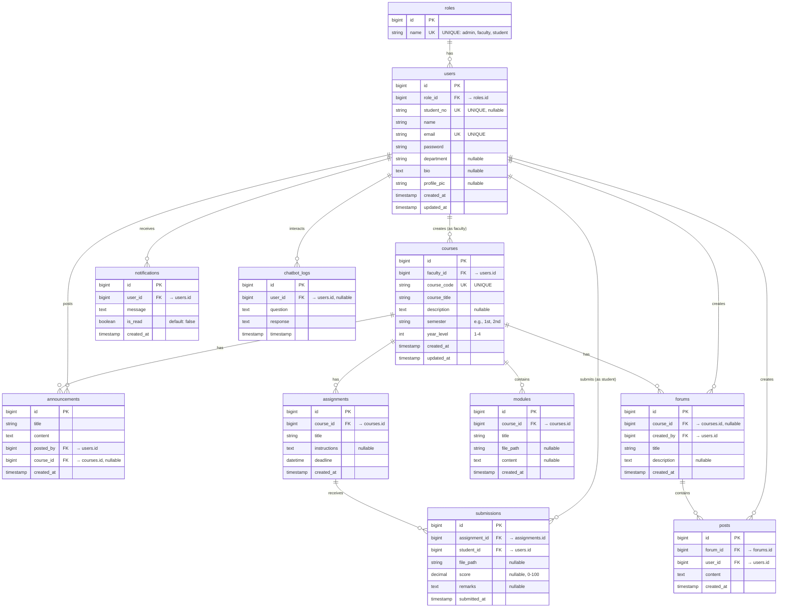

# MINSU E-LEARN Database - Entity Relationship Diagram

## Database Name: `minsu_lms_db`

## ER Diagram (Mermaid Format)

## Entity Descriptions

### 1. **roles**
Stores user role types (admin, faculty, student)
- **Primary Key**: `id`
- **Unique Constraint**: `name`

### 2. **users**
Main user table for all system users
- **Primary Key**: `id`
- **Foreign Keys**: 
  - `role_id` → `roles.id`
- **Unique Constraints**: `email`, `student_no`

### 3. **courses**
Course information created by faculty
- **Primary Key**: `id`
- **Foreign Keys**: 
  - `faculty_id` → `users.id`
- **Unique Constraint**: `course_code`

### 4. **modules**
Learning modules/materials within a course
- **Primary Key**: `id`
- **Foreign Keys**: 
  - `course_id` → `courses.id` (CASCADE on delete)

### 5. **assignments**
Course assignments with deadlines
- **Primary Key**: `id`
- **Foreign Keys**: 
  - `course_id` → `courses.id` (CASCADE on delete)

### 6. **submissions**
Student assignment submissions
- **Primary Key**: `id`
- **Foreign Keys**: 
  - `assignment_id` → `assignments.id` (CASCADE on delete)
  - `student_id` → `users.id`

### 7. **forums**
Discussion forums (course-specific or general)
- **Primary Key**: `id`
- **Foreign Keys**: 
  - `course_id` → `courses.id` (nullable, CASCADE on delete)
  - `created_by` → `users.id`

### 8. **posts**
Individual posts within forums
- **Primary Key**: `id`
- **Foreign Keys**: 
  - `forum_id` → `forums.id` (CASCADE on delete)
  - `user_id` → `users.id`

### 9. **announcements**
System or course announcements
- **Primary Key**: `id`
- **Foreign Keys**: 
  - `posted_by` → `users.id`
  - `course_id` → `courses.id` (nullable, SET NULL on delete)

### 10. **notifications**
User notifications
- **Primary Key**: `id`
- **Foreign Keys**: 
  - `user_id` → `users.id` (CASCADE on delete)

### 11. **chatbot_logs**
AI chatbot interaction logs
- **Primary Key**: `id`
- **Foreign Keys**: 
  - `user_id` → `users.id` (nullable, SET NULL on delete)

## Relationships Summary

| Parent Table | Relationship Type | Child Table | Cardinality |
|--------------|-------------------|-------------|-------------|
| `roles` | One-to-Many | `users` | 1:N |
| `users` (faculty) | One-to-Many | `courses` | 1:N |
| `users` (student) | One-to-Many | `submissions` | 1:N |
| `users` | One-to-Many | `posts` | 1:N |
| `users` | One-to-Many | `announcements` | 1:N |
| `users` | One-to-Many | `notifications` | 1:N |
| `users` | One-to-Many | `chatbot_logs` | 1:N |
| `users` | One-to-Many | `forums` | 1:N |
| `courses` | One-to-Many | `modules` | 1:N |
| `courses` | One-to-Many | `assignments` | 1:N |
| `courses` | One-to-Many | `forums` | 1:N (nullable) |
| `courses` | One-to-Many | `announcements` | 1:N (nullable) |
| `assignments` | One-to-Many | `submissions` | 1:N |
| `forums` | One-to-Many | `posts` | 1:N |

## Indexes Recommendations

### Primary Indexes (Auto-created)
- All `id` columns (Primary Keys)

### Foreign Key Indexes
- `users.role_id`
- `courses.faculty_id`
- `modules.course_id`
- `assignments.course_id`
- `submissions.assignment_id`
- `submissions.student_id`
- `forums.course_id`
- `forums.created_by`
- `posts.forum_id`
- `posts.user_id`
- `announcements.posted_by`
- `announcements.course_id`
- `notifications.user_id`
- `chatbot_logs.user_id`

### Additional Indexes for Performance
- `users.email` (UNIQUE)
- `users.student_no` (UNIQUE)
- `courses.course_code` (UNIQUE)
- `submissions(assignment_id, student_id)` (Composite)
- `notifications(user_id, is_read)` (Composite)
- `posts.created_at` (For sorting)
- `announcements.created_at` (For sorting)

## Cascade Rules

### ON DELETE CASCADE
- `modules` → When course deleted, delete all modules
- `assignments` → When course deleted, delete all assignments
- `submissions` → When assignment deleted, delete all submissions
- `posts` → When forum deleted, delete all posts
- `notifications` → When user deleted, delete all notifications

### ON DELETE SET NULL
- `announcements.course_id` → When course deleted, set to NULL (keep announcement)
- `chatbot_logs.user_id` → When user deleted, set to NULL (keep logs)

### ON DELETE RESTRICT
- `courses.faculty_id` → Cannot delete user if they have courses
- `forums.created_by` → Cannot delete user if they created forums

## Database Statistics (Estimated)

| Table | Estimated Rows | Growth Rate |
|-------|---------------|-------------|
| `roles` | 3 | Static |
| `users` | 500-2000 | Slow (Annual) |
| `courses` | 50-200 | Moderate (Semester) |
| `modules` | 500-2000 | Moderate |
| `assignments` | 200-1000 | Moderate |
| `submissions` | 5000-50000 | High (Daily) |
| `forums` | 20-100 | Slow |
| `posts` | 1000-10000 | High (Daily) |
| `announcements` | 100-500 | Moderate |
| `notifications` | 10000-100000 | High (Daily) |
| `chatbot_logs` | 5000-50000 | High (Daily) |

---

**Created for**: MINSU E-LEARN - An E-Learning Collaboration Platform for MinSU Bongabong Campus  
**Database Type**: MySQL (via XAMPP)  
**Backend**: Laravel  
**Frontend**: React  
**Date**: October 2025
